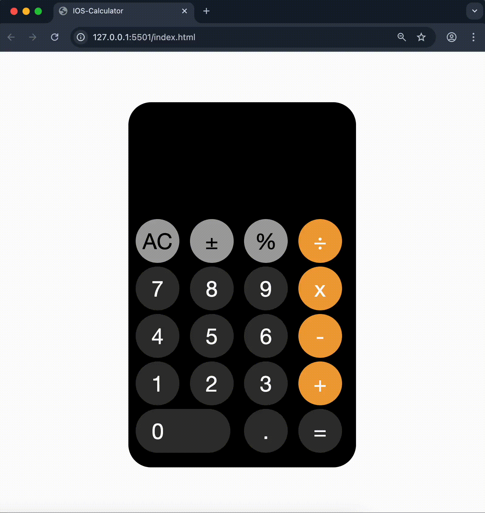

<!-- Please update value in the {}  -->
<p align="center">
  
  
  
  
  
</p>

<h1 align="center">🧮 iOS Calculator</h1>

<div align="center">
  <h3>
    <a href="https://umit8098.github.io/Project-js-IOS-Calculator/">
      🖥️ Live Demo
    </a>
     | 
    <a href="https://umit8098.github.io/Project-js-IOS-Calculator/">
      📂 Repository
    </a>
 
  </h3>
</div>



<!-- TABLE OF CONTENTS -->

## Navigation

- [✨ Overview](#-overview)
- [🚀 Features](#-features)
- [🛠️ Built With](#️-built-with)
- [⚡ How To Use](#-how-to-use)
- [📌 About This Project](#-about-this-project)
- [📬 Contact](#-contact)

<!-- OVERVIEW -->

## ✨ Overview

This project is a **calculator application inspired by the native iOS calculator UI**.

It allows users to perform basic arithmetic operations with a familiar design and smooth interaction, built entirely with **Vanilla JavaScript** without any external libraries or frameworks.


---

## Built With

<!-- This section should list any major frameworks that you built your project using. Here are a few examples.-->
- JavaScript
- HTML
- CSS

## How To Use

<!-- This is an example, please update according to your application -->

To clone and run this application, you'll need [Git](https://github.com/Umit8098/Project-js-IOS-Calculator.git)


```bash
# Clone this repository
$ git clone https://github.com/Umit8098/Project-js-IOS-Calculator.git
```

## About This Project
- IOS Calculator

## Contact

<!-- - Website [your-website.com](https://{your-web-site-link}) -->
- GitHub [@Umit8098](https://github.com/Umit8098)

- Linkedin [@umit-arat](https://linkedin.com/in/umit-arat/)
<!-- - Twitter [@your-twitter](https://{twitter.com/your-username}) -->
